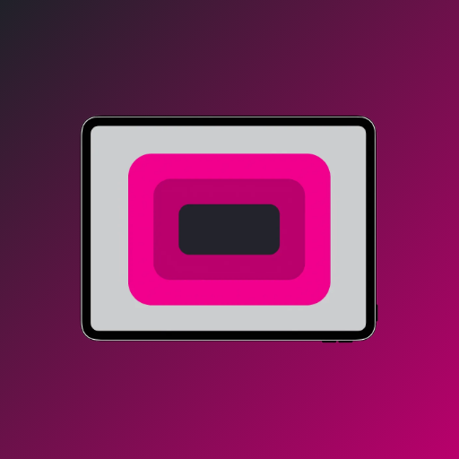
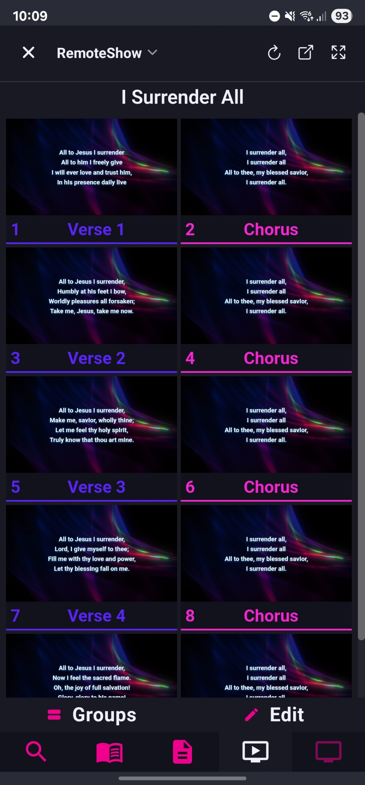
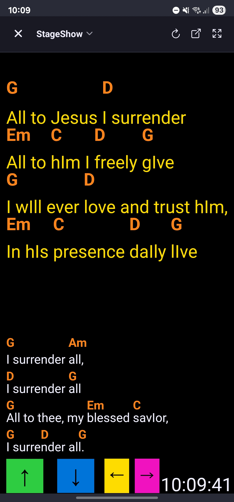

# FreeShow Remote 
A mobile remote app for [FreeShow](https://freeshow.app) presentation software, built with React Native and Expo. Not affiliated with FreeShow.

> **⚠️ Important Note**: Currently only available for Android. The $99/year Apple Developer Program fee makes iOS distribution unfeasible. If you're interested in sponsoring iOS distribution or publishing this on the App Store, please [open an issue](https://github.com/gladsonsam/freeshow-remote/issues) or contact me! Android users can download the APK from the releases page. Will be released to the Play Store in the future.

## Features

- **Auto-discovery**: Automatically finds FreeShow on your network - no need to type IP addresses
- **Quick Show Switching**: Instantly switch between different shows and presentations  
- **Full Integration**: Works with all FreeShow connection types (API, Remote, Output display)
- **Complete Remote Control**: Navigate slides, clear outputs, restore displays, and more

## Screenshots

<div align="center">
  
  
  
</div>

<div align="center">
  
  
  
</div>

## Getting Started

### Prerequisites

- Node.js (v16 or higher)
- Expo CLI (`npm install -g @expo/cli`)
- EAS CLI (`npm install -g @expo/eas-cli`) for building APK/IPA
- FreeShow installed on your computer
- Both devices on the same WiFi network

### Installation

1. Clone the repository:
```bash
git clone https://github.com/gladsonsam/freeshow-remote.git
cd freeshow-remote
```

2. Install dependencies:
```bash
npm install
```

3. Start the development server:
```bash
npm start
```

4. Use the Expo Go app on your mobile device to scan the QR code, or build a standalone app

## Contributing

1. Fork the repository
2. Create your feature branch (`git checkout -b feature/amazing-feature`)
3. Commit your changes (`git commit -m 'Add amazing feature'`)
4. Push to the branch (`git push origin feature/amazing-feature`)
5. Open a Pull Request
